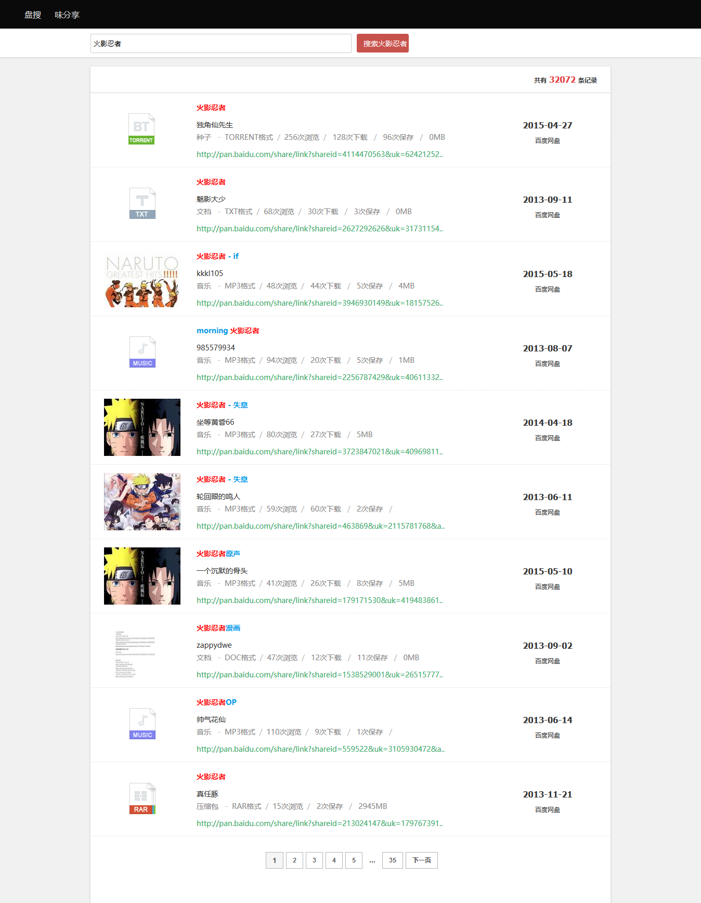
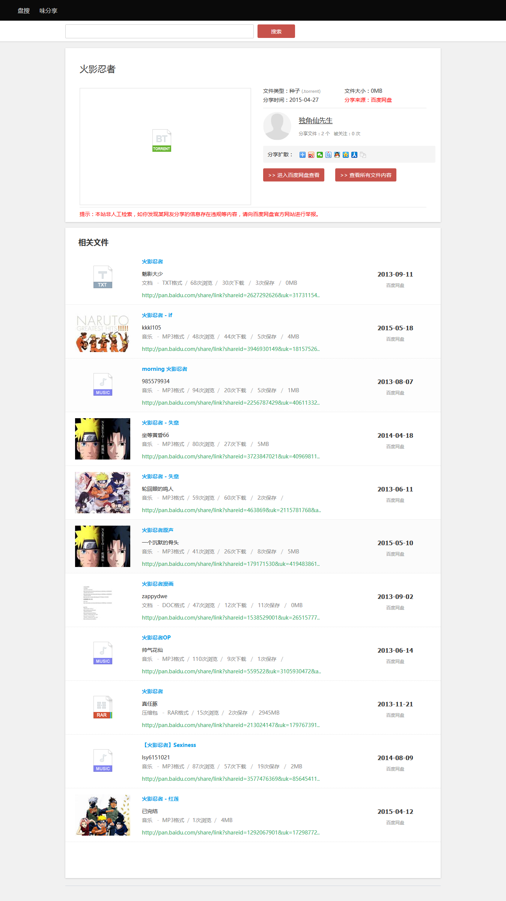
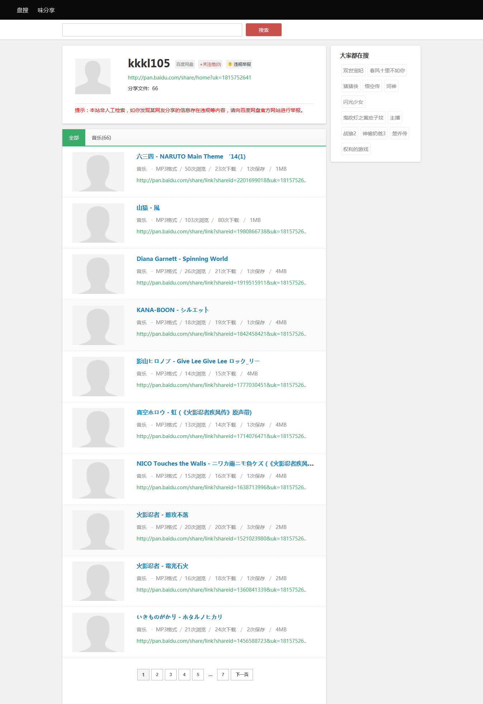

# 盘搜
不是最好的，但是最懂你的网盘搜索引擎

# 基于TP3.2框架自主开发

# 个人独立项目，全网独家所有
# 该PHP程序源码特点：
   a.基于TP3.2开发，实现了高性能、稳定、易部署,方便二次开发

   b.不需要搭建Mysql数据库，省去了复杂的数据库部署

   c.内置第三方插件，包括 百度分享、畅言评论、百度统计，能够最大限度传播你网站的品牌价值

   d.URL使用伪静态，并做了SEO的最优处理,搜索爬虫收录更多

   e.使用了高性能的的缓存技术，大幅提升了性能，轻松应对百万级的并发访问  

   f.无后台管理

 

演示网站： http://pan.liangmlk.cn

该套源码可以打通微信公众号或者小程序，打造一个微信端的搜索自媒体！

#有需求可以联系加wx:cqwanhl
